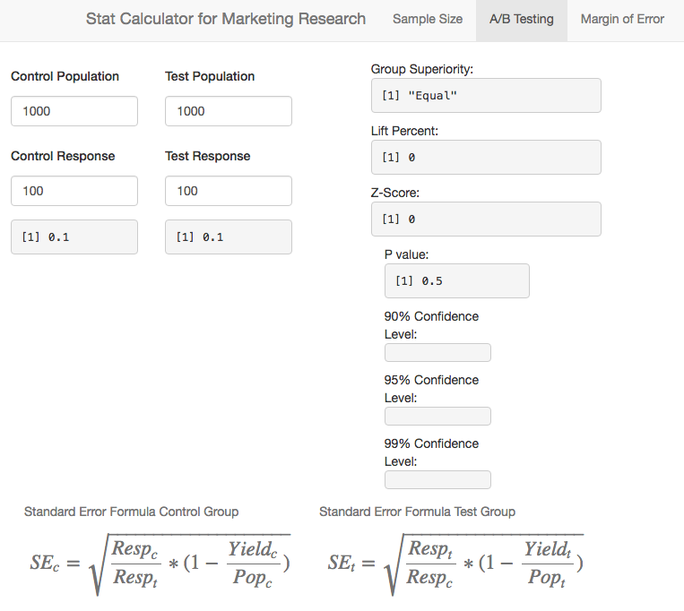
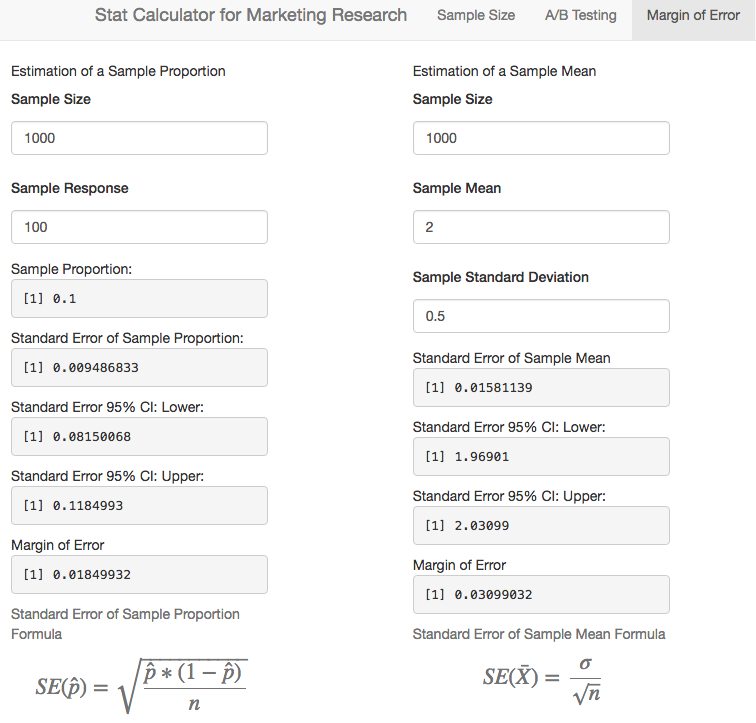

Statistical Calculator for Marketing Research
========================================================
author: Collier King
date: 9/25/2016
autosize: true

Introduction
========================================================

This presentation introduces a statistical calculator made for marketing research.  A wide variety of marketing research tasks rely on statistical inference.

Three such areas covered by this calculator's functionality are:

* Sample Size Computation
* A/B Testing
* Margin of Error Computation

The following slides will describe the functionality of the calculator and the formulas used.

This view the calculator on the web, please visit: https://collier.shinyapps.io/Shiny_StatCalculator/

Sample Size Computation
========================================================

A/B Testing
========================================================

Margin of Error Computation
========================================================

Conclusion
========================================================
Again, you may access this calculator at:
https://collier.shinyapps.io/Shiny_StatCalculator/

Thank you for your interest,
Collier
